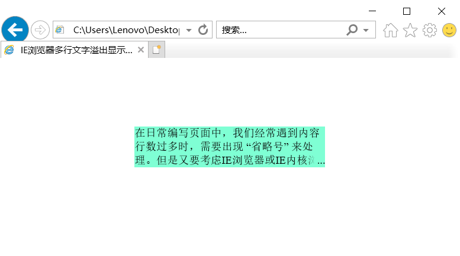
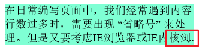

# IE浏览器多行文字溢出显示省略号
- 在日常编写页面中，我们经常遇到内容行数过多时，需要出现 “省略号” 来处理但是又要考虑IE浏览器或IE内核浏览器的兼容性
- 说明：在行高不确定的情况下无法使用此方法
- 缺陷：字数刚好足两行（最多显示三行）时（再多一个字就换行了），会显示第三行空白行


## 标准浏览器的多行文字溢出显示省略号

```css
.myDiv {
  overflow: hidden;
  text-overflow: ellipsis;
  display: -webkit-box;
  -webkit-line-clamp: 3;/* 最多显示三行 */
  -webkit-box-orient: vertical;
}
```
- ie并不识别 `-webkit-` ，即使在书写css时去点 `-webkit-` ，ie也不支持那些属性


## IE兼容版
- 后面有详细介绍

```html
<!DOCTYPE html>
<html lang="en">

<head>
  <meta charset="UTF-8">
  <meta name="viewport" content="width=device-width, initial-scale=1.0">
  <title>IE浏览器多行文字溢出显示省略号</title>
  <style>
    .myDiv {
      background-color: aquamarine;
      width: 280px;
      margin: 100px auto;

      line-height: 20px;
      max-height: 60px;/* 最多显示三行 */

      overflow: hidden;
      position: relative;
    }

    .myDiv:before {
      content: '...';/* 在所在dom内的前面插入的内容 */

      position: absolute;
      top: 40px;/* 60px - 20px ，定位在第三行 */
      right: 0;

      width: 20px;
      text-align: right;
      background-image: linear-gradient(to right, transparent , aquamarine 50%, aquamarine);/* transparent 透明色 */
    }

    .myDiv:after {
      content: '';
      background-color: aquamarine;
      width: 11px;/* 11px刚好遮住三个点 */
      height: 20px;/* 高度设置跟行高一样 */
      float: right;/* 向右浮动起来 */

      position: relative;
      z-index: 1;
    }
  </style>
</head>

<body>
  <div class="myDiv">在日常编写页面中，我们经常遇到内容行数过多时，需要出现 “省略号” 来处理但是又要考虑IE浏览器或IE内核浏览器的兼容性</div>
</body>

</html>
```

- 效果图
  
  在谷歌浏览器里面也一样，完全通用。


## 详细说明

### CSS:before 选择器

- 在dom元素**内**的内容之**前**插入新内容
- 兼容目前所有主流浏览器
- **对于 IE8 及更早版本中的 :before，必须声明 `<!DOCTYPE>`**


### CSS:after 选择器

- 在dom元素**内**的内容之**后**插入新内容
- 兼容目前所有主流浏览器
- 同 :before 一样，**对于 IE8 及更早版本中的 :after，必须声明 `<!DOCTYPE>`**
- 这个属性平时不怎么用，也就在解决高度塌陷时能用得到

```css
/* 解决高度塌陷 */
.myDiv:after {
  content:""; 
  display: block; 
  clear:both; 
}
```


### 知道了:before和:after选择器后

- 首先得知道文字的行高设置，然后根据行高去设置dom的高度
  - 推荐使用 `max-height` 属性设置高度

```css
.myDiv {
  line-height: 20px;
  max-height: 60px;/* 最多显示三行 */
}
```


- 然后 `myDiv` 设置 `overflow: hidden;` ，让其溢出的隐藏


- 再在 `myDiv` **内**的内容前面插入 `...` ，即：

```css
.myDiv:before {
  content: "...";
}
```
**注意，这里是使用 `:before` 伪类**

- 然后将 `...` 定位到 `myDiv` 右下方
  - 不要用 `bottom: 0;` 用 `top` 属性直接定位到最后一行
  - 保证在不足最大行的情况下不显示省略号

```css
.myDiv {
  position: relative;
}
.myDiv:before {
  position: absolute;
  top: 40px;/* 60px - 20px ，定位在第三行 */
  right: 0;
}
```
直接绝对定位到右下方即可


- 设置 `.myDiv:before` 宽度、文本靠左和背景渐变色，背景渐变色颜色要和dom背景颜色一样
  - 注意：设置背景渐变色时用的是 `background-image` 属性，并不是 `background-color`
  - 实测，背景渐变色可以兼容到IE10及以上，即使加上前缀也不兼容（无效属性）
  - 若兼容IE10以下，可以用渐变的背景图片代替，可以兼容到IE8及以上，IE8以下不兼容
    - 发现在IE8以下的版本，`:before` 并未生效，但网上的教程全部都说，只要声明 `<!DOCTYPE>` 即可使用
    - 怀疑我的浏览器和正常的IE低版本浏览器有差异（IE11自带的版本切换）
    - `或者网上的教程都错了？？`
  - 推荐 `.myDiv:before` 中间只写一个 `:` ，发现若两个冒号的话，连IE8都不支持了

```css
.myDiv:before {
  width: 30px;
  text-align: right;
  background-image: linear-gradient(to right, transparent , aquamarine 50%, aquamarine);/* transparent 透明色 */
}
```
兼容性这么差，为啥非要设置背景渐变的这步哩？直接看图：

  
  
发现啥了吧

到这里，基本差不多了，但有一个缺陷：在刚刚够三行时但还没溢出时，省略号不该显示，但我们的会显示

  

所以，继续优化。

- 设置 `myDiv:after` ，使其向右浮动（不是定位），覆盖住省略号
  - 兼容性同 `:before` 一样

```css
.myDiv:after {
  content: '';
  background-color: aquamarine;
  width: 11px;/* 11px刚好遮住三个点 */
  height: 20px;/* 高度设置跟行高一样 */
  float: right;/* 向右浮动起来 */

  position: relative;/* 此处的定位的作用仅是让 z-index 生效的 */
  z-index: 1;
}
```
这里的 `position: relative` 作用仅仅是让 `z-index` 生效

- ***为什么是 `:before` 定位， `:after` 浮动呢？俩颠倒用行不？***
  - **答：不行，浮动，是在文档流当前位置浮动起来，浮动起来后脱离文档流，但改变不了它在哪儿脱离的文档流，`:before` 是在dom内最前方插入的，他在最前方浮动起来，即使向右浮动，也是在第一行最右边，而 `:after` 本身是在dom内最末尾插入的，它浮动起来，就会最末行浮动向右，当刚好*三*行就可以挡住定位在最有边的省略号，超过*三*行，就在溢出的行最右边，省略号就不会被阻挡而显示，所以不能颠倒使用**

- 有个小小的缺陷：字数刚好足两行（最多显示三行）时（再多一个字就换行了），有时会显示第三行空白行

  

- 最后，全部样式代码：

```css
.myDiv {
  background-color: aquamarine;
  width: 280px;
  margin: 100px auto;

  line-height: 20px;
  max-height: 60px;/* 最多显示三行 */

  overflow: hidden;
  position: relative;
}

.myDiv:before {
  content: '...';/* 在所在dom内的前面插入的内容 */

  position: absolute;
  top: 40px;/* 60px - 20px ，定位在第三行 */
  right: 0;

  width: 20px;
  text-align: right;
  background-image: linear-gradient(to right, transparent , aquamarine 50%, aquamarine);/* transparent 透明色 */
}

.myDiv:after {
  content: '';
  background-color: aquamarine;
  width: 11px;/* 11px刚好遮住三个点 */
  height: 20px;/* 高度设置跟行高一样 */
  float: right;/* 向右浮动起来 */

  position: relative;
  z-index: 1;
}
```
- 注：在用了此方法后，就不要再用标准浏览器的方法了，不然，在标准浏览器中查看，会显示俩省略号（六个点）

**转载请说明出处**